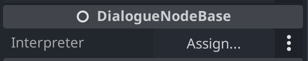
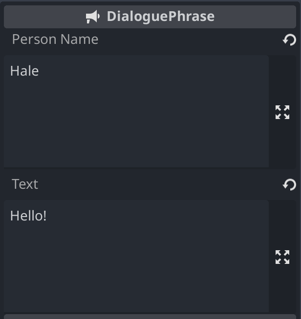
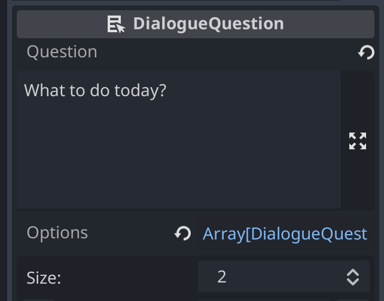
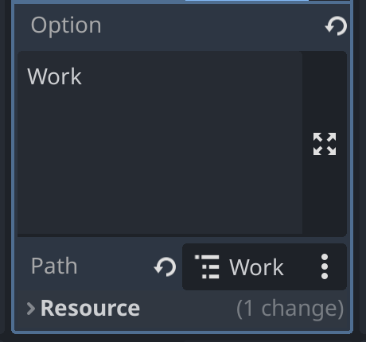

# Node-based dialogue system

Two core concepts of this system are **dialogue nodes** and **interpreters**.

Dialogue is composed with **dialogue nodes** in a scene tab and later executed via **interpreter** in a script.

## Dialogue nodes
Base class: [`DialogueNodeBase`](./dialogue_node_base.gd).

Every node has:
- `start_dialogue` method

Used for starting interpreter with dialogue data.
Must be redefined in a derived class.

- `interpreter` accessor

Access node's **`Interpreter`** property. If property is not set in the editor, accessor will attempt to find an interpreter above in a node tree. If none is found, prints an error.

- `Interpreter` property

### Phrase

Class: [`DialoguePhrase`](./blocks/dialogue_phrase.gd).

Dialogue node with `name` and `text` multiline properties.

When executed via `start_dialogue`, will run `say` method of an interpreter with phrase name and text.

## Question

Class: [`DialogueQuestion`](./blocks/dialogue_question.gd).

Dialogue node with `question` and `options` properties.

When executed via `start_dialogue`, will run `ask` method of an interpreter with question text and options texts array.

`ask` method **must** return index of choosen question option.

`option` is a `DialogueQuestionOption` custom resource with `text` and `path` node path, used for alter dialogue execution path.

Class: [`DialogueQuestionOption`](./blocks/dialogue_question_option.gd).

## Group

Class: [`DialogueGroup`](./blocks/dialogue_group.gd).

Dialogue node used for grouping other nodes.

When executed via `start_dialogue`, will run `start_dialogue` of each of it's children sequentially.

Children's `start_dialogue` can return node path of another dialogue node, and it's `start_dialogue` will be executed in a sequence as well. This behaviour provides a way to change a way of dialogue execution through question dialogue node, for example.

## Dialogue interpreter
Base node: [`DialogueInterpreterBase`](./dialogue_interpreter_base.gd).

Every derived node must redefine:
- `say(name: String, text: String)`

Used when executing `Phrase` dialogue node.

- `ask(question: String, options: Array[String]) -> int`

Used when executing `Question` dialogue node. 
Must return index of options from `options` array.

## Example
Scene: [`dialogue_example.tscn`](./example/dialogue_example.tscn).

Example interpreters:
- [`DialogueInterpreterConsole`](./example/interpreter_console.gd) for printing in a console

- [`DialogueInterpreterUI`](./example/interpreter_ui.gd) for ui-based dialogue.
